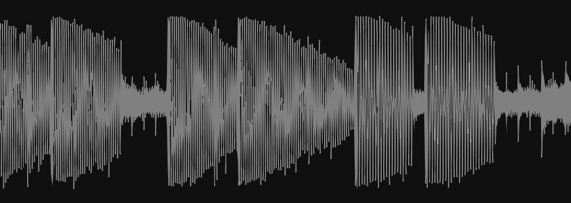

<div align="center">
  <h1>Cyma</h1>
</div>
<div align="center">
  <a href="https://github.com/223230/cyma/actions/workflows/test.yml"></a>
  <a href="https://github.com/223230/cyma/actions/workflows/docs.yml"></a>
</div>
<br/>
<div align="center">
  Composable views and associated data structures for <a href="https://github.com/robbert-vdh/nih-plug">nih-plug</a> UIs made using <a href="https://github.com/vizia/vizia">VIZIA</a>.
</div>

<hr/>

> [!CAUTION]
> **Don't use this library in production!** It is *very* early in development and a stable release is yet to be made. If you want to use it, expect frequent breaking changes. Wanna contribute? [Read this.](#🙋-contributing)

<hr/>

## ✨ Overview

Cyma is a collection of flexible, composable views that you can use to make any
plug-in UI with ease. It uses various custom ring buffers for real-time
visualizers, allowing you to easily build plug-in UIs that are performant.

Read the <a href="https://223230.github.io/cyma/">docs</a> (incomplete)

## ❓ Example

Here's how to create a basic oscilloscope with a grid background.



```rust
fn oscilloscope(cx: &mut Context) {
    ZStack::new(cx, |cx| {
        Grid::new(cx, (-1.2, 1.2), 10.0, vec![0.0, 0.5, -0.5, 1.0, -1.0])
            .color(Color::rgb(60, 60, 60));
        Oscilloscope::new(cx, Data::oscilloscope_buffer, (0., 1.2), false)
            .color(Color::rgba(0, 0, 0, 0))
            .background_color(Color::rgba(255, 255, 255, 120));
    })
    .border_color(Color::rgb(80, 80, 80))
    .border_width(Pixels(1.))
    .background_color(Color::rgb(16, 16, 16));
}
```

Here, `Data::oscilloscope_buffer` is an `Arc<Mutex<WaveformBuffer>>`, a special
buffer that allows for your audio to be sent to the `Oscilloscope` in a much
smaller package, while retaining peak information. In the above screenshot, the
buffer was configured to be 512 samples long, and it represents 10 seconds of
audio at 44.1 kHz.

It's very plug-and-play, you only need to call `enqueue_buffer()` in your
plugin's process function to use it!

## 🧰 What's included

Check out [this](https://github.com/223230/cyma/milestone/1) milestone to see
what views will eventually be added. Do you think something's missing? File a
feature request so it can be added!

### 📊 Visualizers

**General/Utility**
  - Grid backdrop
  - Unit ruler

**Peak/Waveform Analysis**
  - Peak graph
  - Oscilloscope
  - Static waveform

### 🎛️ Controls

### 🛠️ Utils

**Buffers**
  - **RingBuffer** - A generic circular buffer
  - **WaveformBuffer** - A buffer for waveform analysis
  - **PeakBuffer** - A buffer for peak analysis

## 🍔 Composing views

A core feature of Cyma is composability.

For example, by combining views such as the `Grid`, `UnitRuler`, and
`PeakGraph`, you can make this real-time peak analyzer that you can style
however you want.


```rust
fn peak_graph(cx: &mut Context) {
    HStack::new(cx, |cx| {
        ZStack::new(cx, |cx| {
            Grid::new(
                cx,
                (-32.0, 8.0),
                0.0,
                vec![6.0, 0.0, -6.0, -12.0, -18.0, -24.0, -30.0],
            )
            .color(Color::rgb(60, 60, 60));

            PeakGraph::new(cx, Data::peak_buffer, (-32.0, 8.0), true)
                .color(Color::rgba(255, 255, 255, 160))
                .background_color(Color::rgba(255, 255, 255, 60));
        })
        .border_color(Color::rgb(80, 80, 80))
        .border_width(Pixels(1.))
        .background_color(Color::rgb(16, 16, 16));

        UnitRuler::new(
            cx,
            (-32.0, 8.0),
            vec![
                (6.0, "6db"),
                (0.0, "0db"),
                (-6.0, "-6db"),
                (-12.0, "-12db"),
                (-18.0, "-18db"),
                (-24.0, "-24db"),
                (-30.0, "-30db"),
            ],
            Orientation::Vertical,
        )
        .font_size(12.)
        .color(Color::rgb(160, 160, 160))
        .width(Pixels(32.));
    })
    .col_between(Pixels(8.));
}
```

## 🙋 Contributing

This project is in a really early stage, which is why I won't be accepting code
contributions just yet. If you want to contribute, you can feel free to play
around with it and report any bugs, glitches, or other oddities by filing an
[issue](https://github.com/223230/cyma/issues).

## 📃 License

This project is licensed under the [MPL](LICENSE).
