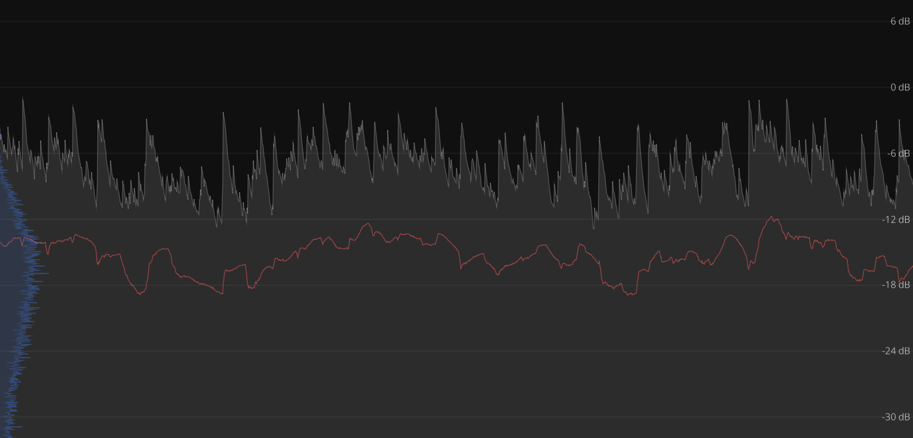

<div align="center">
  
  <h1>CYMA</h1>
  
  [Documentation] | [Book] | [Examples] | [Contributing]
  
  Composable views and associated data structures for <a href="https://github.com/robbert-vdh/nih-plug">nih-plug</a> UIs made using <a href="https://github.com/vizia/vizia">VIZIA</a>.
  
  <a href="https://github.com/exa04/cyma/actions/workflows/test.yml"></a>
  <a href="https://github.com/exa04/cyma/actions/workflows/docs.yml"></a>
  <a href="https://deps.rs/repo/github/exa04/cyma"></a>
</div>

[Documentation]: https://exa04.github.io/cyma
[Book]: https://exa04.github.io/cyma/book
[Examples]: ./examples/
[Contributing]: CONTRIBUTING.md

---

## ✨ Overview

CYMA is a collection of flexible, composable views that you can use to make rich
plug-in user interfaces with ease. It uses various custom data structures for
real-time visualizers, allowing you to easily build beautiful, performant
plug-in UIs.

Here's a demo ([YouTube mirror](https://www.youtube.com/watch?v=He70jwvdjFU))

https://github.com/user-attachments/assets/456a6705-5936-4118-a527-fb8999a91041

Wanna see the code behind this? It's [this example!](./examples/visualizers)

> [!TIP]
> A version of Cyma that experimentally supports [`vizia-plug`](https://github.com/vizia/vizia-plug) instead of `nih-plug-vizia` is in the works.<br>
> You can check it out on the [`vizia-plug` branch](https://github.com/exa04/cyma/tree/vizia_plug).

## 🧰 What's included

Do you think something's missing? File a feature request so it can be added!

### 📊 Visualizers

**General/Utility**
  - Grid backdrop
  - Unit ruler

**Peak/Waveform Analysis**
  - Meter
  - Graph
  - Oscilloscope
  - Static waveform

**Stereo imaging**
  - Lissajous

**Spectral analysis**
  - Spectrum Analyzer

## ❓ Example

Here's how to create a basic oscilloscope.


Visualizers communicate with your plugin via busses. One bus can feed multiple
visualizers. Just add it to your plugin like so:

```rust
pub struct OscopePlugin {
    params: Arc<OscopeParams>,
    bus: Arc<MonoBus>,
}

impl Plugin for OscopePlugin {
    fn initialize(
        &mut self,
        _: &AudioIOLayout,
        buffer_config: &BufferConfig,
        _: &mut impl InitContext<Self>,
    ) -> bool {
        self.bus.set_sample_rate(buffer_config.sample_rate);
        true
    }

    fn process(
        &mut self,
        buffer: &mut Buffer,
        _: &mut AuxiliaryBuffers,
        _: &mut impl ProcessContext<Self>,
    ) -> ProcessStatus {
        if self.params.editor_state.is_open() {
            self.bus.send_buffer_summing(buffer);
        }
        ProcessStatus::Normal
    }

    fn editor(&mut self, _async_executor: AsyncExecutor<Self>) -> Option<Box<dyn Editor>> {
        editor::create(
            self.bus.clone(),
            self.params.editor_state.clone(),
        )
    }
    
    ...
}
```

Now, in your editor code, you just need to subscribe to the bus. Then, you can
use it for visualizers like this oscilloscope:

```rust
pub fn create(
    bus: Arc<MonoBus>,
    editor_state: Arc<ViziaState>,
) -> Option<Box<dyn Editor>> {
    create_vizia_editor(editor_state, ViziaTheming::default(), move |cx, _| {
        bus.subscribe(cx);
        Oscilloscope::new(cx, bus.clone(), 4.0, (-1.0, 1.0), ValueScaling::Linear)
            .color(Color::rgb(120, 120, 120));
    })
}
```


Check out the book or the [examples](examples) to familiarize yourself with this
system.

## 🍔 Composing views

A core feature of CYMA is composability.

For example, by combining views such as the `Grid`, `UnitRuler`, `Graph`, and
`Histogram` you can make this real-time peak graph with an RMS plot and a
histogram overlay.



```rust
ZStack::new(cx, |cx| {
    Grid::new(
        cx,
        ValueScaling::Linear,
        (-32., 8.0),
        vec![6.0, 0.0, -6.0, -12.0, -18.0, -24.0, -30.0],
        Orientation::Horizontal,
    )
    .border_width(Pixels(0.5))
    .color(Color::rgb(30, 30, 30));
    Graph::peak(
        cx,
        bus.clone(),
        10.0,
        50.0,
        (-32.0, 8.0),
        ValueScaling::Decibels,
    )
    .color(Color::rgba(255, 255, 255, 60))
    .background_color(Color::rgba(255, 255, 255, 30));
    Graph::rms(
        cx,
        bus.clone(),
        10.0,
        250.0,
        (-32.0, 8.0),
        ValueScaling::Decibels,
    )
    .color(Color::rgba(255, 92, 92, 128));
    Histogram::new(cx, bus.clone(), 250.0, (-32.0, 8.0), ValueScaling::Decibels)
        .width(Pixels(64.0))
        .color(Color::rgba(64, 128, 255, 64))
        .background_color(Color::rgba(64, 128, 255, 32));
    UnitRuler::new(
        cx,
        (-32.0, 8.0),
        ValueScaling::Linear,
        vec![
            (6.0, "6 dB"),
            (0.0, "0 dB"),
            (-6.0, "-6 dB"),
            (-12.0, "-12 dB"),
            (-18.0, "-18 dB"),
            (-24.0, "-24 dB"),
            (-30.0, "-30 dB"),
        ],
        Orientation::Vertical,
    )
    .font_size(12.)
    .color(Color::rgb(220, 220, 220))
    .right(Pixels(8.0))
    .left(Stretch(1.0));
});
```

## 🙋 Contributing

If you want to contribute through issues and code contributions, read the
[Contributing Guidelines](./CONTRIBUTING.md) first.

## 📃 License

This project is licensed under the [MPL](LICENSE).
