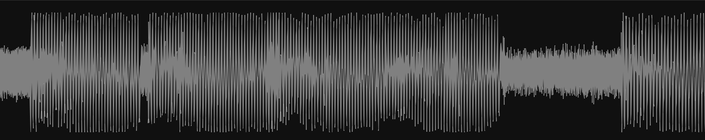

<div align="center">
  
  <h1>Cyma</h1>
</div>
<div align="center">
  <a href="https://github.com/223230/cyma/actions/workflows/test.yml"></a>
  <a href="https://github.com/223230/cyma/actions/workflows/docs.yml"></a>
  <a href="https://deps.rs/repo/github/223230/cyma"></a>
  <a href="https://github.com/223230/cyma/milestone/1"></a>
</div>
<br/>
<div align="center">
  Composable views and associated data structures for <a href="https://github.com/robbert-vdh/nih-plug">nih-plug</a> UIs made using <a href="https://github.com/vizia/vizia">VIZIA</a>.
</div>

---

## ✨ Overview

Cyma is a collection of flexible, composable views that you can use to make rich
plug-in user interfaces with ease. It uses various custom data structures for
real-time visualizers, allowing you to easily build beautiful, performant
plug-in UIs.

Here's a demo:

https://github.com/223230/cyma/assets/68156346/7911ef05-c229-4f08-8d70-41c5475c6379

<sub>Excuse the poor frame rate, my PC is slow at media encoding :(</sub>

Wanna see the code behind this? It's [this example](./examples/visualizers)!

## 🧰 What's included

Check out [this project](https://github.com/users/223230/projects/5/views/3) to see
what views will eventually be added. Do you think something's missing? File a
feature request so it can be added!

### 📊 Visualizers

**General/Utility**
  - Grid backdrop
  - Unit ruler

**Peak/Waveform Analysis**
  - Meter
  - Graph
  - Oscilloscope
  - Static waveform

**Stereo imaging**
  - Lissajous

**Spectral analysis**
  - Spectrum Analyzer

## ❓ Example

Here's how to create a basic oscilloscope with a grid background.



```rust
Oscilloscope::new(
    cx,
    Data::oscilloscope_buffer,
    (-1.2, 1.2),
    ValueScaling::Linear,
)
.background_color(Color::rgba(120, 120, 120));
```

Here, `Data::oscilloscope_buffer` is an `Arc<Mutex<WaveformBuffer>>`, a buffer
that allows for your audio to be sent to the `Oscilloscope` in a much smaller
package, while retaining peak information. Here, it's configured to be 512
samples long, and it represents 10 seconds of audio at 44.1 kHz.

It's very plug-and-play, you only need to call `enqueue_buffer()` in your
plugin's process function to use it!

Check out the book, or the [examples](examples) to learn how to work with these
buffers.

## 🍔 Composing views

A core feature of Cyma is composability.

For example, by combining views such as the `Grid`, `UnitRuler`, and
`PeakGraph`, you can make this real-time peak analyzer.


```rust
fn peak_graph(cx: &mut Context) {
    HStack::new(cx, |cx| {
        ZStack::new(cx, |cx| {
            Grid::new(
                cx,
                ValueScaling::Linear,
                (-32., 8.),
                vec![6.0, 0.0, -6.0, -12.0, -18.0, -24.0, -30.0],
                Orientation::Horizontal,
            )
            .color(Color::rgb(60, 60, 60));

            Graph::new(cx, Data::peak_buffer, (-32.0, 8.0), ValueScaling::Decibels)
                .color(Color::rgba(255, 255, 255, 160))
                .background_color(Color::rgba(255, 255, 255, 60));
        })
        .background_color(Color::rgb(16, 16, 16));

        UnitRuler::new(
            cx,
            (-32.0, 8.0),
            ValueScaling::Linear,
            vec![
                (6.0, "6db"),
                (0.0, "0db"),
                (-6.0, "-6db"),
                (-12.0, "-12db"),
                (-18.0, "-18db"),
                (-24.0, "-24db"),
                (-30.0, "-30db"),
            ],
            Orientation::Vertical,
        )
        .font_size(12.)
        .color(Color::rgb(160, 160, 160))
        .width(Pixels(32.));
    })
    .col_between(Pixels(8.));
}
```

## 🙋 Contributing

If you have questions about Cyma, need help with something, or want to show off
what you built using it, head over to the [Discussions](https://github.com/223230/cyma/discussions) tab.

If you want to contribute through issues and code contributions, read the
[Contributing Guidelines](./CONTRIBUTING.md) first

## 📃 License

This project is licensed under the [MPL](LICENSE).
