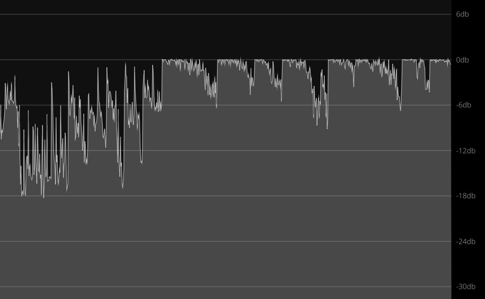

# Peak Graph

> [!NOTE]
> This code is taken from the *Composing a Peak Graph* chapter of the Cyma Book.

A peak analyzer plugin.

This example plug-in uses a peak buffer that stores incoming audio as peaks that
decay in amplitude. The buffer is behind an `Arc<Mutex>`. By cloning the Arc, a
reference is sent to the editor. The editor uses the buffer to draw a `PeakGraph`.

Behind it is a grid, and to the side of it is a unit ruler. These views are composed
using VIZIA's *Stack* views.