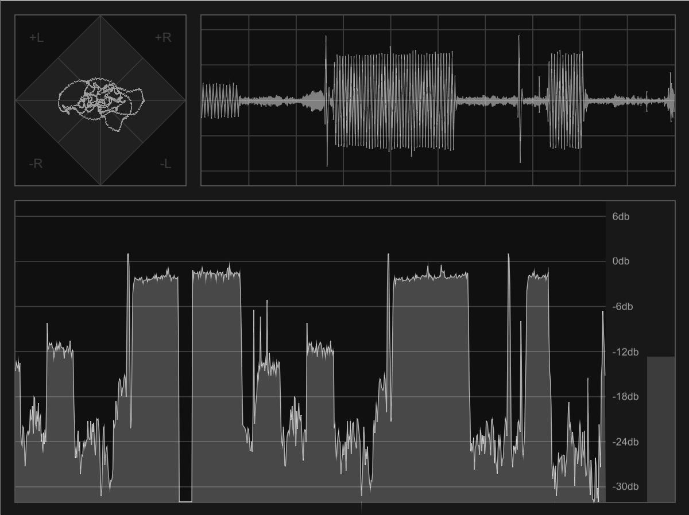

# Visualizers

An example plug-in showcasing all Cyma visualizers.

This plug-in stores the incoming audio in various buffers that are behind
`Arc<Mutex>`es. Then, by cloning the Arcs, references to each buffer are sent to
the editor. The editor uses these buffers to draw its visualizers.

It stacks Cyma's visualizers, rulers, and grids, using VIZIA's built-in `Stack`
views. For encapsulation's sake, these stacks are created by dedicated
functions. This is a matter of preference, though - There's nothing keeping you
from doing it all inside the `create()` function.
